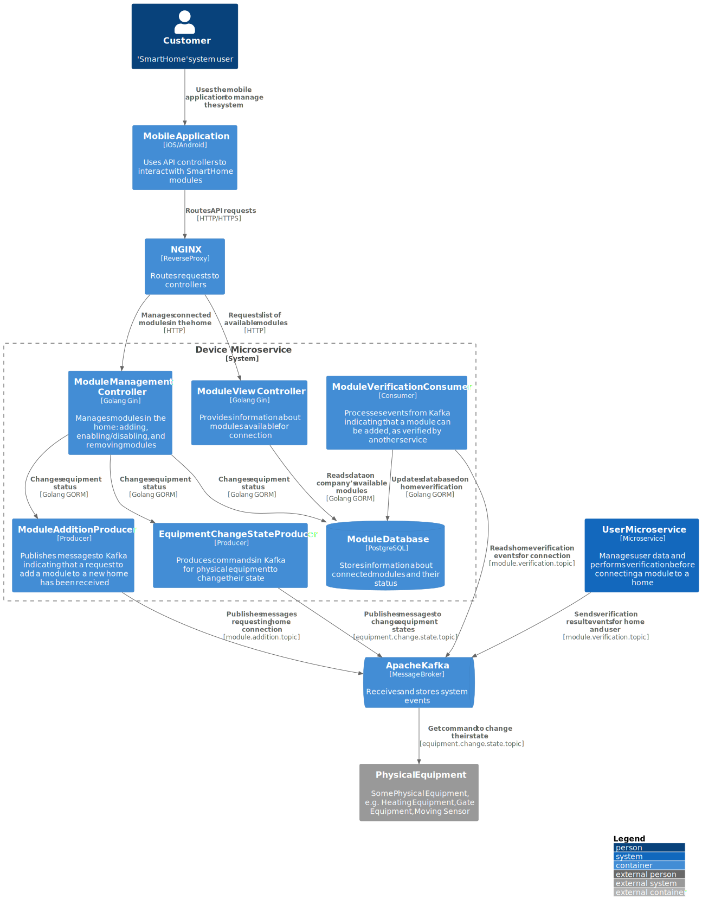

# Содержание
- [Сервис для управления модулями умного дома "Smart Home"](#сервис-для-управления-модулями-умного-дома-smart-home)
- [Логика работы добавления модуля](#логика-работы-добавления-модуля)
- [Логика управления модулем](#логика-управления-модулем)
- [Логика получения модулей](#логика-получения-модулей)
- [C4 Device Service component diagram](#c4-device-service-component-diagram)
- [C4 Device Service code diagram](#c4-device-service-code-diagram)

### Сервис для управления модулями умного дома "Smart Home"
Отвечает за отображение всех модулей, доступных для подключения в системе "Smart Home", 
и управление состоянием уже подключённых модулей.

### Логика работы добавления модуля:
1. **Добавление модуля пользователем** <i>POST /modules/houses/:houseID/modules/:moduleID/assign</i>: 
   Пользователь отправляет запрос на ручку добавления модуля в свой дом, API шлюз проксирует запрос в данный микросервис.

2. **Отправка ивента в Kafka**:  
   Сервис отправляет ивент в Kafka для микросервиса пользователей (`UserService`) в топик `module.addition.topic`, 
   тем самым запрашивая возможность установки.

3. **Верификация пользователя**:  
   `UserService` проверяет, может ли пользователь установить данный модуль в свой дом.

4. **Прослушивание ответа верификации**:  
   Сервис слушает топик `module.verification.topic` для получения подтверждения верификации от `UserService`.
    - Если верификация пройдена успешно, создаётся запись в таблице `home_modules` с положительным статусом подключения, 
      подключение успешно.
    - Если верификация не пройдена, в `home_modules` создаётся запись с отрицательным статусом и поделючения не производится.

### Логика управления модулем:
1. **Управление модулем**:  
   После успешного подключения пользователь может отправлять команды в контроллер управления модулями. 
   Например, он может направить запрос на выполнение определённых действий через подключённый модуль 
   на ручку <i>/modules/houses/:houseID/modules/:moduleID/state</i>.

   * **Выключить модуль** — это позволяет временно приостановить работу любого подключённого модуля.
   ```
   {
       "homeId": uuid,
       "moduleId": uuid,
       "state": {"running": "off"}
   }
   ```

   * **Открыть ворота** — позволяет отдать команду модулю автоматических ворот на открытие.
   ```
   {
       "homeId": uuid,
       "moduleId": uuid,
       "state": {"gate": "open"}
   }
   ```

   - **Увеличить температуру в помещении** — отдаётся команда на повышение температуры.  
     *(Пример: `"state": {"changeTemperature": -5}` — уменьшает температуру на 5 градусов, тем самым охлаждая помещение.)*
   ```
   {
       "homeId": uuid,
       "moduleId": uuid,
       "state": {"changeTemperature": 5}
   }
   ```

   * А также **другие команды**, которые могут быть подключены и реализованы в микросервисе для конкретного оборудования.
   ```
   {
       "homeId": uuid,
       "moduleId": uuid,
       "state": ...
   }
   ```
   
   После получения команд для физического оборудования, микросервис `DeviceService` отправляет команды в Kafka 
   в топик `equipment.change.state.topic`, из Kafka они доходят до оборудования и оно изменяет своё состояние, 
   осуществляя бизнес логику управления от клиента через мобильное приложение.

2. **Отключения модуля**:  
   Помимо временной паузы работы модуля у сервиса `DeviceService` есть ручки для отключения/включения модуля:

   * <i>POST /modules/houses/:houseID/modules/:moduleID/turn-on</i>
   * <i>POST /modules/houses/:houseID/modules/:moduleID/turn-off</i>


### Логика получения модулей:
   1. **Получение всех модулей**, модули прописываются в БД во время миграций при запуске Docker контейнера:
   <i>GET /modules/</i>

   2. **Получение модулей, подключенных к дому**:
   <i>GET /modules/houses/:houseID</i>

### Логика выполнения команд оборудованием от сервиса телеметрии:
В сервис может придти ивент от сервиса телеметрии (`TelemetryService`), например датчик движения может триггеруть систему открыть ворота 
или может быть полезным автоматически выключать котлы при слишком высоких значениях с датчиков температуры, 
схема ивента изменения состояния оборудования по запросу от сервиса телеметрии аналогична схеме запроса 
на изменение состояния оборудования от пользователя.

примечание: <b>После поднятия контейнеров более подробный Swagger доступен по ссылке:
http://0.0.0.0:8080/service/swagger/index.html </b>

### C4 Device Service component diagram


### C4 Device Service code diagram

